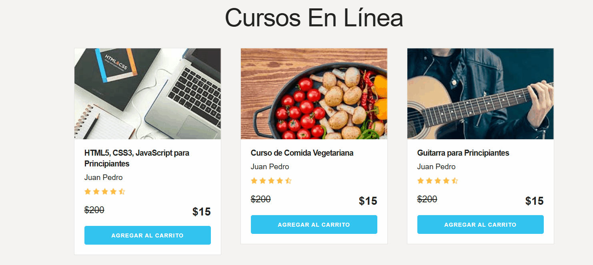

# 🛒 Carrito de Compras - JS Vanilla (Ruta MERN)
## 📽️ Demostración del Funcionamiento

| 🛒 Añadir Productos | 🗑️ Vaciar / Eliminar |
| :---: | :---: |
|  |  |

> **Nota:** La aplicación utiliza **Delegación de Eventos** para gestionar ambos procesos de forma eficiente con un único listener en el contenedor padre.

**[🔗 Ver Demo en Vivo](https://pabloramirezcasas.github.io/js-vanilla-shopping-cart/)**


Este proyecto es una aplicación funcional de carrito de compras donde se aplican conceptos fundamentales de JavaScript Moderno (ES6+) como base técnica antes de la transición a React.

## 🚀 Funcionalidades
- **Gestión Dinámica:** Agregar y eliminar elementos del carrito mediante manipulación del DOM.
- **Validación de Integridad:** Control de duplicados para evitar redundancia en la selección.
- **Interfaz Reactiva:** Actualización del UI en tiempo real basada en el estado del carrito.
- **Persistencia de Datos:** (Próximamente) Implementación de LocalStorage.

## 🛠️ Conceptos Técnicos Aplicados
- **Event Delegation:** Optimización de memoria mediante el manejo de burbujeo (bubbling) desde contenedores raíz.
- **DOM Scripting:** Uso de `querySelector`, `createElement` y gestión de nodos.
- **JavaScript Moderno:** Desestructuración de objetos, Template Literals y Arrow Functions.
- **Estética:** Skeleton CSS Framework para un diseño ligero y responsivo.

## 💡 Aprendizajes Clave
El enfoque principal fue la **Delegación de Eventos**. Comprendí la eficiencia de asignar un único listener al padre en lugar de múltiples listeners a elementos dinámicos, lo cual es una práctica esencial para el rendimiento y la escalabilidad de aplicaciones web.

## 🔧 Instalación y Uso

1. Clona el repositorio:
```bash
git clone https://github.com/PabloRamirezCasas/js-vanilla-shopping-cart.git